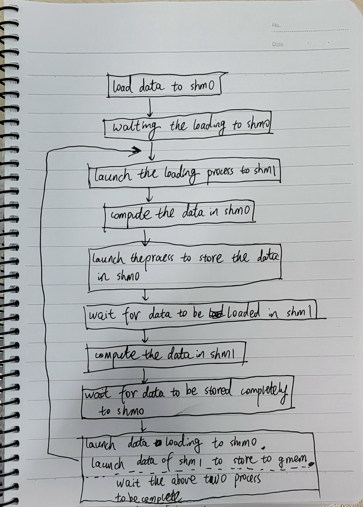

using double buffer and tma load to get (0.5 + element * element) / 0.3


```bash
python3 setup.py install
python3 test.py
```

pipeline:
```bash
        |     |      |       |      |
shm0: L |C S L| C S L| C S L |C S   | 
shm1:   |L C S| L C S| L C S |L C S |


#the pipeline for study3:
        |     |     |     |     |
shm0: L | C+S | L   | C+S | L   | C+S 
shm1:   | L   | C+S | L   | C+S | L C+S 

```

L means load data, C means computatonm, S means store.


According to the pipeline design program software pipeline: 



Although a multi-stage pipeline was added, the program in study4 runs even slower than in study3. Considering that our operators are purely element-wise, and after discussions with several professionals, we believe the slower speed is due to:
1.Only used two shms to complete the three-stage pipeline, actually we should use three shms for the three-stage pipeline.
2.I profiled the operators of study3 and study4 using ncu. Due to the limitations of shared memory, the number of active blocks per SM at any given time is 1. As a result, the SM hardware can only achieve hardware-level parallelism by switching between different warps within a block. For the pipeline in study3, C+S is always being executed by all warps within the block at any time, so C+S is parallelized by the hardware. However, for each for loop stage3 in study4, only L and S are executed, which wastes the compute units. Moreover, all warps within the block are waiting, effectively wasting this portion of time.

However, this does not prevent the program from serving as a learning example for TMA here.